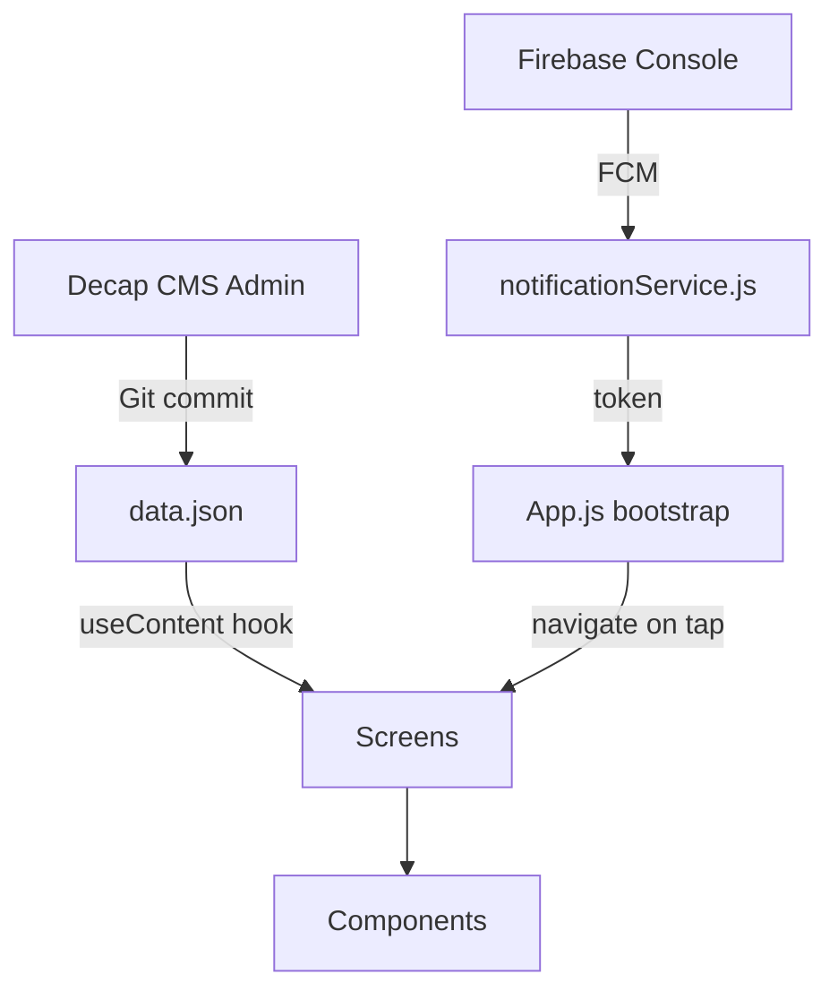
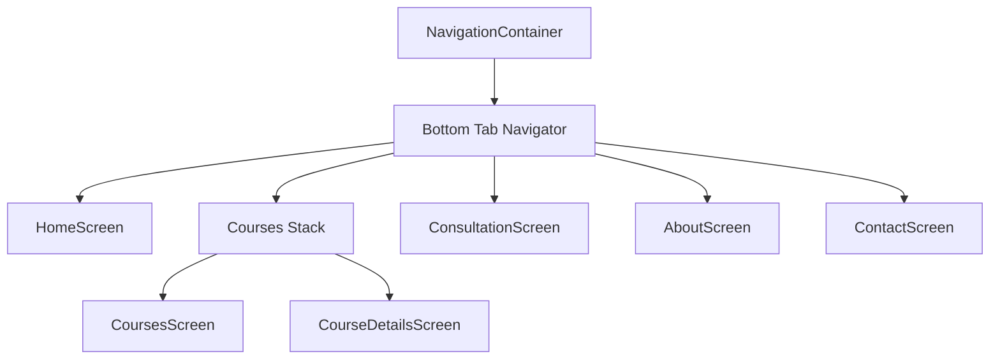

# Inspection Academy — React Native Architecture

## Project Structure

```
IA-app/
├── App.js                          # Entry — fonts, navigation, Firebase bootstrap
├── app.json                        # Expo config (plugins, FCM, permissions)
├── google-services.json            # 🔴 Add from Firebase Console
│
├── src/
│   ├── constants/
│   │   ├── theme.js                # Colors, Typography, Spacing, Shadows
│   │   └── routes.js               # ROUTES enum
│   │
│   ├── components/                 # Reusable UI
│   │   ├── TopAppBar.jsx           # Header (back|menu + right action)
│   │   ├── CourseCard.jsx          # Course list card
│   │   ├── TrainingEventCard.jsx   # Upcoming event card
│   │   ├── ServiceCard.jsx         # 2-col grid card (Home/Consultation)
│   │   ├── AccordionItem.jsx       # Spring-animated expand/collapse
│   │   ├── PrimaryButton.jsx       # filled | outlined | tonal CTA
│   │   └── FormInput.jsx           # Label + icon + error state input
│   │
│   ├── screens/
│   │   ├── HomeScreen.jsx          # Hero, events, services
│   │   ├── CoursesScreen.jsx       # Search + filter + FlatList
│   │   ├── CourseDetailsScreen.jsx # Accordion + stats + CTA bar
│   │   ├── ConsultationScreen.jsx  # Service cards + quote CTA
│   │   ├── AboutScreen.jsx         # Stats grid + mission/vision
│   │   └── ContactScreen.jsx       # Validated form + HQ info
│   │
│   ├── navigation/
│   │   └── AppNavigator.jsx        # Bottom tab + Courses stack
│   │
│   ├── hooks/
│   │   └── useContent.js           # CMS data hook
│   │
│   └── services/
│       └── notificationService.js  # Expo/Firebase push notifications
│
└── cms/
    ├── admin/
    │   ├── index.html              # Decap CMS SPA
    │   └── config.yml              # CMS schema
    └── content/
        └── data.json               # All content (single source of truth)
```

## Data Flow



## Navigation Tree



## Firebase Notification Setup Checklist

- [ ] Create Firebase project at [console.firebase.google.com](https://console.firebase.google.com)
- [ ] Add Android app → download `google-services.json` → place in project root
- [ ] Add iOS app → download `GoogleService-Info.plist` → place in project root
- [ ] Run `npx eas init` and copy project ID into `app.json → extra.eas.projectId`
- [ ] Build with EAS: `npx eas build --profile development --platform android`
- [ ] Implement `saveTokenToFirestore(token)` in `notificationService.js`

## Decap CMS Setup Checklist

- [ ] Push project to GitHub
- [ ] Create Netlify site linked to repo
- [ ] Enable **Identity** in Netlify dashboard
- [ ] Enable **Git Gateway** under Identity → Services
- [ ] Visit `yoursite.netlify.app/admin` to log in
- [ ] Invite editors via Netlify Identity

### CMS Collections Defined

| Collection | File/Folder | Purpose |
|---|---|---|
| `site_settings` | `data.json` | Name, tagline, address, contact |
| `courses` | `cms/content/courses/` | Course cards + detail content |
| `events` | `cms/content/events/` | Upcoming training events |
| `consultation` | `cms/content/consultation/` | Service card entries |
| `about` | `cms/content/about.json` | Stats, mission, vision |

## Component API Reference

### `<TopAppBar>`
| Prop | Type | Default | Description |
|---|---|---|---|
| `title` | string | `'Inspection Academy'` | Header text |
| `showBack` | bool | `false` | Shows back arrow instead of menu |
| `rightAction` | string | `'search'` | `'search'` \| `'share'` \| `null` |
| `onRightPress` | fn | — | Right button handler |

### `<CourseCard>`
| Prop | Type | Description |
|---|---|---|
| `course` | object | Course data from `data.json` |
| `onPress` | fn | Navigation to CourseDetailsScreen |

### `<AccordionItem>`
| Prop | Type | Default | Description |
|---|---|---|---|
| `title` | string | — | Section heading |
| `children` | node | — | Collapsible content |
| `defaultOpen` | bool | `false` | Start expanded |

### `<PrimaryButton>`
| Prop | Type | Default | Description |
|---|---|---|---|
| `label` | string | — | Button text |
| `variant` | string | `'filled'` | `'filled'` \| `'outlined'` \| `'tonal'` |
| `fullWidth` | bool | `false` | Stretch to container |
| `disabled` | bool | `false` | Disable state |
| `icon` | node | — | Right icon element |

### `useContent(section?)`
```js
const { data, loading, error } = useContent('courses');
// Returns the full data.json or a specific top-level section
```

> [!TIP]
> To switch from local JSON to a remote CMS API, update `useContent.js` to fetch from your Netlify/Decap API endpoint. The rest of the app requires no changes.

> [!IMPORTANT]
> `google-services.json` must be present in the project root before running `eas build`. The file is gitignored — never commit it publicly.

> [!NOTE]
> Run `npx expo start` with Expo Go for development without Firebase. Push notifications only work on physical devices with a production build.
